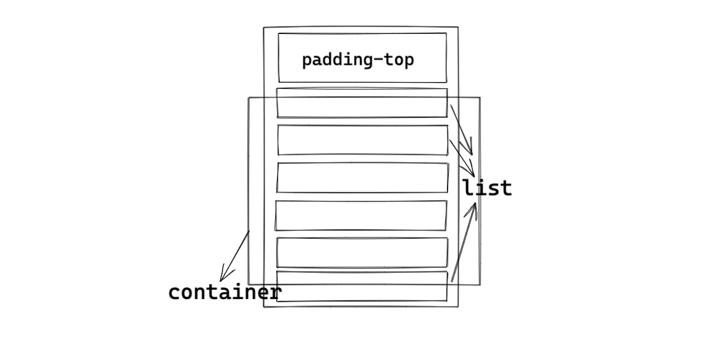

# infinite-scroll

實作無限下拉列表，使用craco覆蓋create-react-app配置處理跨域請求，使用eslint和prettier作為程式碼格式化工具。


## 啟動

```
npm install && npm start
```


## 項目組織

| 資料夾     | 作用     |
| ---------- | -------- |
| assets     | 靜態文件 |
| components | 組件     |
| pages      | 頁面     |
| Service    | 網路請求 |


## 無限滾動原理



container為滑動容器，只渲染屏幕所見的列表，沒有渲染的部分以padding-top撐開，同時給定整體高度。

